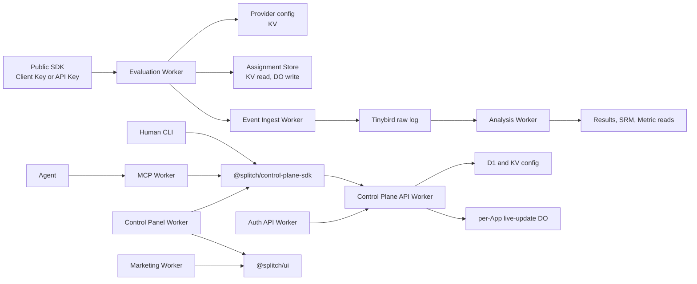

# System architecture: Worker boundaries

Status: designed, docs-first.
Vocabulary: domain terms follow [CONTEXT.md](../../CONTEXT.md). This page is the map for physical
deploy units and import boundaries. The detailed build layout lives in
[monorepo-and-toolchain.md](../spec/platform/monorepo-and-toolchain.md).

## Architecture rule

splitch uses capability Workers. A Worker is a trust boundary, not a foldering preference.

Do not collapse MCP, Evaluation, Event Ingest, Analysis, Auth API, or Control Plane API into a
generic `api` or `edge` Worker. Shared code moves into `packages/` only when it passes the deletion
test. Worker-specific bindings and orchestration stay inside the owning Worker.



## Worker boundaries

| Worker                   | Trust boundary               | Owns                                                                                                                                                     | Must not own                                                               |
| ------------------------ | ---------------------------- | -------------------------------------------------------------------------------------------------------------------------------------------------------- | -------------------------------------------------------------------------- |
| Control Plane API Worker | Authenticated management API | Organization, App, Environment, Flag definition, Flag Configuration, Promotion, Experiment, Run, Metric, Segment, Client Key, API Key, generated OpenAPI | MCP transport, public SDK evaluate, event ingest, Tinybird result reads    |
| MCP Worker               | Agent protocol adapter       | Remote MCP OAuth PRM/auth.md handshake, tool registry, schema derivation, calls through `@splitch/control-plane-sdk`                                     | D1/KV/Tinybird bindings, domain invariants, direct Worker imports          |
| Evaluation Worker        | Data-plane resolution        | Public evaluate and peek, control-plane dry-run test-eval, Provider reads, Assignment Store reads/writes, Exposure creation                              | Config mutation, Tinybird result reads, Metric/statistical calculation     |
| Event Ingest Worker      | Append-only intake           | Assignment, Exposure, and Metric event validation; queueing; sharded Durable Object dedup; Tinybird delivery                                             | Variant resolution, Run lifecycle, results calculation, control-plane CRUD |
| Analysis Worker          | Results read model           | Tinybird proxy reads, SRM, Metric and statistical result contracts, `app_id` and `environment_id` injection from auth/path context                       | SDK evaluate, event ingest, config mutation                                |
| Auth API Worker          | Identity and token surface   | OAuth metadata, ID-JAG/device/anonymous doors, token issuance, token revocation, provisional create handoff                                              | Post-create Organization/App management, SDK credentials, analytics        |
| Control Panel Worker     | Authenticated UI             | SSR routes, loader session validation, TanStack Query cache, live-update socket lifecycle                                                                | Domain invariants, direct storage access, direct Worker code imports       |
| Marketing Worker         | Public UI                    | Static/prerendered marketing surface, shared design system usage                                                                                         | Authenticated App data, control-plane SDK transport, Worker bindings       |

## Runtime flows

### Evaluation flow

1. SDK calls the Evaluation Worker with a Client Key or API Key scoped to one Environment.
2. Evaluation Worker validates the credential, reads Provider config from KV, and reads holdover state
   from the Assignment Store.
3. Evaluation Worker resolves the Variant and creates the Exposure row when the accessor is `evaluate`.
   `peek` and dry-run test-eval are structurally non-exposing paths.
4. Evaluation Worker hands the raw event to Event Ingest Worker. It does not import ingest code.

### Event and analysis flow

1. Event Ingest Worker validates event envelopes and owns queueing, sharded dedup, and Tinybird delivery.
2. Tinybird remains the append-only system of record.
3. Analysis Worker is the only Worker that proxies Tinybird result reads to users or agents.
4. Analysis Worker injects `app_id` and `environment_id`; clients and agents never supply Tinybird
   scope directly.

### Control-plane flow

1. Human CLI, Control Panel Worker, and MCP Worker call `@splitch/control-plane-sdk`.
2. `@splitch/control-plane-sdk` calls the Control Plane API Worker.
3. Control Plane API Worker enforces management invariants and writes D1/KV config.
4. Live updates use the per-App fan-out DO. UI clients receive nudges, then refetch through the typed
   client.

### Agent flow

1. Agent connects to MCP Worker.
2. MCP Worker performs the auth.md/OAuth PRM handshake and derives tools from Zod route schemas.
3. MCP Worker calls `@splitch/control-plane-sdk`.
4. MCP Worker never imports Control Plane API Worker code and never binds D1, KV, Tinybird, or Durable
   Objects directly.

## Dependency-cruiser enforcement

The architecture is enforced at the import graph, not by convention. The root
[`.dependency-cruiser.cjs`](../../.dependency-cruiser.cjs) defines these rules:

| Rule                                          | Enforces                                                                                                                         |
| --------------------------------------------- | -------------------------------------------------------------------------------------------------------------------------------- |
| `no-app-to-other-app-imports`                 | Deployable apps cannot import another app's code. Cross-app communication uses HTTP, queues, service bindings, or typed clients. |
| `no-shared-package-to-app-imports`            | `packages/` stay reusable and cannot import apps.                                                                                |
| `contracts-stays-schema-only`                 | `@splitch/contracts` cannot import runtime code, UI, or transport packages.                                                      |
| `control-plane-sdk-does-not-import-apps`      | `@splitch/control-plane-sdk` cannot import apps.                                                                                 |
| `ui-stays-domain-free`                        | `@splitch/ui` cannot import contracts, the Control Plane SDK, or apps.                                                           |
| `marketing-does-not-import-control-plane-sdk` | Marketing cannot import the Control Plane SDK.                                                                                   |

The gate runs as:

```sh
pnpm depcruise --config .dependency-cruiser.cjs "apps/**/*.{ts,tsx}" "packages/**/*.{ts,tsx}"
```

CI should fail on any dependency-cruiser `error`. A rule exception needs an architecture update first,
then a narrow config change.

## Sources

- [../spec/platform/monorepo-and-toolchain.md](../spec/platform/monorepo-and-toolchain.md)
- [../spec/control-plane/access-control-matrix.md](../spec/control-plane/access-control-matrix.md)
- [../spec/control-plane/control-plane-endpoint-inventory.md](../spec/control-plane/control-plane-endpoint-inventory.md)
- [../spec/pipeline/edge-ingest-contract.md](../spec/pipeline/edge-ingest-contract.md)
- [../adr/0017-all-cloudflare-stack-workers-serving-and-control-tinybird-analytics.md](../adr/0017-all-cloudflare-stack-workers-serving-and-control-tinybird-analytics.md)
- [../adr/0023-remote-mcp-and-cli-as-parity-skins-over-a-shared-typed-client.md](../adr/0023-remote-mcp-and-cli-as-parity-skins-over-a-shared-typed-client.md)
